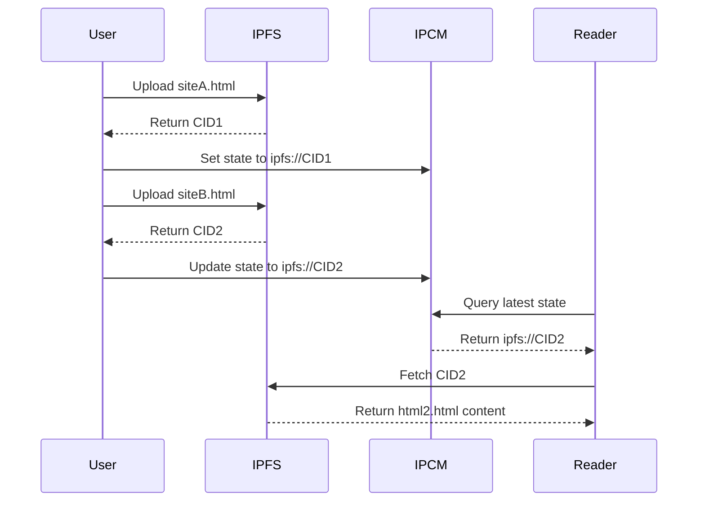

## IPCM - Solana

**InterPlanetary CID Mapping**


**IPCM is a smart contract that points to an IPFS CID which can be updated onchain, providing a simple solution to dynamic offchain data using IPFS**

[IPFS](https://ipfs.io) has been the go-to decentralized network for sharing content and websites. However it's greatest strength, immutability, is also it's greatest weakness. There are cases where you might need to update content on IPFS, but that would result in a new CID. IPCM (InterPlanetary CID Mapping) aims to solve this by storing a simple IPFS string onchain and letting the contract be the point of reference for the latest state. Benefits include:

- Cryptographically secures ownership and updates to an onchain identity
- Events create an onchain history of updates
- Can be deployed to any EVM chain
- Fetching the latest state is simple and fast

A simple example IPCM is for static webhosting on IPFS, where you can update the IPFS reference onchain without having to deal with the compliexities of IPNS. [Check out the more detailed example below](#example-demo)



## Quick Start

Make sure you have Foundry already installed on your machine, more details [here](https://book.getfoundry.sh/getting-started/installation)

### Contract Deployment

Clone the GitHub repo and install dependencies

```
git clone https://github.com/PinataCloud/ipcm
cd ipcm
forge install
```

Deploy the contract in one command

```
forge create src/IPCM.sol:IPCM \
  --rpc-url <YOUR_CHAIN_RPC_URL> \
  --private-key <ACCOUNT_PRIVATE_KEY>
```

> [!TIP]
> It is preferable to setup an account with [cast](https://book.getfoundry.sh/tutorials/best-practices?highlight=wallet#private-key-management) or another secure method instead of using the private key in plain text. Please practice safe key management!

Optional: Verify the contract after deployment

```
forge v <CONTRACT_ADDRESS> \
  src/IPCM.sol:IPCM \
  -e <ETHERSCAN_API_KEY> \
  --rpc-url <YOUR_CHAIN_RPC_URL>
```

### Contract Usage

After IPCM is deployed you can update the CID mapping using the `updateMapping` function and the library of your choice. Here is an example with [Viem](https://viem.sh/docs/contract/writeContract#writecontract)

```typescript
import { account, publicClient, walletClient } from "./config";
import { abi } from "./ipcm_abi";

const { request } = await publicClient.simulateContract({
  account,
  address: "0xFBA3912Ca04dd458c843e2EE08967fC04f3579c2",
  abi: abi,
  functionName: "updateMapping", // Function to Update
  args: ["ipfs://bafkreigfakpjywuxaq57zhnnma6ntvs6u5p6eurgdl5kfkjvuhg6sztmda"], // IPFS CID args
});
await walletClient.writeContract(request);
```

Once a CID has been written to the contract, it can be fetched using the `getMapping` function.

```typescript
import { publicClient } from "./client";
import { abi } from "./ipcm_abi";

const data = await publicClient.readContract({
  address: "0xFBA3912Ca04dd458c843e2EE08967fC04f3579c2",
  abi: abi,
  functionName: "getMapping",
});
// ipfs://bafkreigfakpjywuxaq57zhnnma6ntvs6u5p6eurgdl5kfkjvuhg6sztmda
```

With the CID reference you can render it into content using a tool like the [IPFS SDK](https://docs.pinata.cloud/web3/sdk)

```typescript
import { publicClient } from "./client";
import { abi } from "./ipcm_abi";
import { PinataSDK } from "pinata-web3";

const pinata = new PinataSDK({
  pinataJwt: process.env.PINATA_JWT!,
  pinataGateway: "example-gateway.mypinata.cloud",
});

const cidMapping = await publicClient.readContract({
  address: "0xFBA3912Ca04dd458c843e2EE08967fC04f3579c2",
  abi: abi,
  functionName: "getMapping",
});

const { data, contentType } = await pinata.gateways.get(cidMapping);
```

### Example Demo

The [IPCM.dev](https://ipcm.dev/) website is an example of how IPCM can be used for static webhosting. It consists of a simple Cloudflare Worker that fetches the contract state each time a request is made and renders the content through an IPFS Gateway, creating a static proxy which only requires updating the onchain reference to update the site.

```typescript
import { createPublicClient, http } from "viem";
import { baseSepolia } from "viem/chains";
import { abi } from "../utils/contract";
import { pinata } from "../utils/pinata";

export default {
  async fetch(
    request: Request,
    env: Env,
    ctx: ExecutionContext,
  ): Promise<Response> {
    try {
      const publicClient = createPublicClient({
        chain: baseSepolia,
        transport: http(),
      });

      const cid = await publicClient.readContract({
        address: "0x81FBD1886121f8575734808959DF808D19De170D",
        abi: abi,
        functionName: "getMapping",
      });

      if (!cid) {
        throw new Error(`Failed to fetch latest state: ${cid}`);
      }

      const url = await pinata.gateways.convert(cid as string);

      const response = await fetch(url);

      if (!response.ok) {
        throw new Error(`Failed to fetch from CDN: ${response.statusText}`);
      }

      const contentType = response.headers.get("content-type");

      return new Response(response.body, {
        status: 200,
        headers: {
          "Content-Type": contentType || "text/html",
          "Cache-Control": "public, max-age=3600",
        },
      });
    } catch (error) {
      console.error("Error:", error);
      return new Response(`Error: ${error}`, {
        status: 500,
        headers: { "Content-Type": "text/plain" },
      });
    }
  },
} satisfies ExportedHandler<Env>;
```

## Questions and Feedback

IPCM is MIT licensed and open source; feedback and contributions are welcome! Please contact [team@pinata.cloud](mailto:team@pinata.cloud) with any questions you might have.
