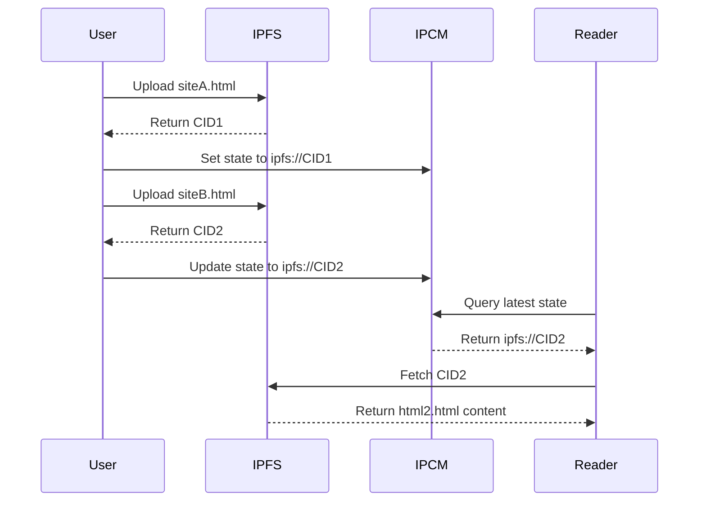

## IPCM - Solana

**InterPlanetary CID Mapping**


**IPCM is a smart contract that points to an IPFS CID which can be updated onchain, providing a simple solution to dynamic offchain data using IPFS**

> [!WARNING]
> This Solana adaptation of the original IPCM in Solidity is still under construction. Contributions to improve UX are welcome!

[IPFS](https://ipfs.io) has been the go-to decentralized network for sharing content and websites. However it's greatest strength, immutability, is also it's greatest weakness. There are cases where you might need to update content on IPFS, but that would result in a new CID. IPCM (InterPlanetary CID Mapping) aims to solve this by storing a simple IPFS string onchain and letting the contract be the point of reference for the latest state.

A simple example IPCM is for static webhosting on IPFS, where you can update the IPFS reference onchain without having to deal with the compliexities of IPNS.



## Quick Start

Make sure you have Solana and Anchor installed on your machine, more details [here](https://solana.com/docs/intro/installation)

### Contract Deployment

Clone the GitHub repo and build the project

```
git clone https://github.com/PinataCloud/ipcm-solana ipcm
cd ipcm
anchor build
```

Get the Program ID by running this command

```
solana address -k target/deploy/ipcm-keypair.json
```

Take the Program ID and update it in `programs/ipcm/src/lib.rs` and `Anchor.toml`

Make sure the `Anchor.toml` file is accurate, particularly with your current solana config as to whether you're running localnet, devnet, or mainnet. Then run the command below:

```
anchor deploy
```

### Contract Usage

Reference the the `tests/script.ts` file to see how IPCM can be used in a Solana dApp

## Questions and Feedback

IPCM is MIT licensed and open source; feedback and contributions are welcome! Please contact [team@pinata.cloud](mailto:team@pinata.cloud) with any questions you might have.
